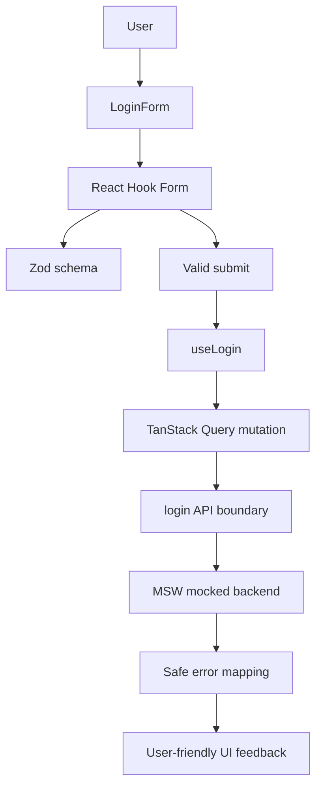

# boring-login-done-right

A small login flow built with care.

Not flashy. Just one common frontend feature implemented with clean structure, validation, accessible form behavior, mocked API states, safe error handling, tests, and production-minded decisions.

## Why this project exists

Login forms look simple, but they touch many important frontend concerns.

**Form state** — The UI needs predictable input, validation, and submit behavior.

**Validation** — User input should be checked before it reaches the API boundary.

**Accessibility** — Errors, labels, and interactions should work beyond visual mouse usage.

**API boundaries** — React components should not know backend implementation details.

**Error handling** — Users should see clear messages, not raw backend failures.

**Testing** — A small feature should still be protected against regressions.

**Security-aware frontend behavior** — Credentials and sensitive auth details should not leak into logs, UI, analytics, or monitoring.

The goal is not to build a complete authentication platform. The goal is to build a focused login flow that feels reliable, maintainable, and ready to grow.

## Tech stack

| Area                          | Tools                                                                                     |
| ----------------------------- | ----------------------------------------------------------------------------------------- |
| Core                          | React, TypeScript, Vite                                                                   |
| Forms                         | React Hook Form                                                                           |
| Validation                    | Zod                                                                                       |
| Form/schema integration       | React Hook Form Resolvers (`@hookform/resolvers`)                                         |
| Server state and API handling | TanStack Query, typed API boundaries, Fetch API                                           |
| API mocking                   | MSW                                                                                       |
| UI and styling                | Tailwind CSS, shadcn/ui                                                                   |
| Testing                       | Vitest, React Testing Library, `@testing-library/user-event`, `@testing-library/jest-dom` |
| Code quality                  | ESLint, Prettier, TypeScript strict mode                                                  |
| CI                            | GitHub Actions                                                                            |

## Features

### Done

- Email and password login form
- Schema-based validation with Zod
- React Hook Form integration
- Validation on blur
- Error clearing while editing
- Accessible labels and error messages
- Correct autocomplete attributes
- Reusable form components
- Typed login API boundary
- TanStack Query login mutation
- MSW mocked login responses
- Frontend-safe error codes
- User-friendly error message mapping
- Unit tests for validation and error mapping
- Component tests for form behavior
- API tests with mocked responses
- TypeScript strict mode
- ESLint and Prettier setup
- GitHub Actions quality checks

### Planned

- Stronger loading and pending states
- Disabled submit while logging in
- Double-submit prevention
- Slow-network feedback
- Skeleton loading UI
- Forgot password route
- Protected dashboard route
- Session checking
- Redirect behavior after login
- Password visibility toggle
- Remember-me checkbox
- Responsive layout polish
- Internationalization
- Playwright end-to-end tests
- Accessibility tests with axe
- Storybook documentation
- Frontend error monitoring
- Safe analytics events
- Final portfolio polish

## API states

| Scenario             | Mock input               | Result                             |
| -------------------- | ------------------------ | ---------------------------------- |
| Successful login     | `success@example.com`    | Returns a user                     |
| Account not verified | `unverified@example.com` | Returns `ACCOUNT_NOT_VERIFIED`     |
| Rate limited         | `limited@example.com`    | Returns `RATE_LIMITED`             |
| Server error         | `server@example.com`     | Returns `SERVER_ERROR`             |
| Network error        | `network@example.com`    | Simulates a failed network request |
| Slow response        | `slow@example.com`       | Delays before returning success    |
| Invalid credentials  | Any other email          | Returns `INVALID_CREDENTIALS`      |

## Project structure

```txt
frontend/
  src/
    app/
      providers.tsx        # App-level providers, such as TanStack Query.

    components/
      forms/               # Shared form building blocks.
      layout/              # Shared layout components.
      ui/                  # Reusable UI primitives.

    features/
      login/
        api/               # Login request boundary and API response handling.
        components/        # Login-specific UI components.
        hooks/             # Login mutation and feature-level behavior.
        model/             # Login types, validation schema, and error definitions.
        tests/             # Tests for the login feature.

    lib/
      queryClient.ts       # Shared TanStack Query client configuration.

    mocks/
      browser.ts           # MSW setup for the browser.
      server.ts            # MSW setup for tests.
      handlers/            # Mocked API handlers.

    test/                  # Shared test setup.
```

## Login flow architecture



## Getting started

```bash
git clone https://github.com/carolinapapes/boring-login-done-right.git
cd boring-login-done-right/frontend
pnpm install
pnpm dev
```

## Available scripts

| Command             | Purpose                                        |
| ------------------- | ---------------------------------------------- |
| `pnpm dev`          | Starts the Vite development server.            |
| `pnpm build`        | Builds the project for production.             |
| `pnpm preview`      | Previews the production build locally.         |
| `pnpm typecheck`    | Runs TypeScript checks without emitting files. |
| `pnpm lint`         | Runs ESLint with zero warnings allowed.        |
| `pnpm lint:fix`     | Runs ESLint and fixes issues when possible.    |
| `pnpm format`       | Formats files with Prettier.                   |
| `pnpm format:check` | Checks whether files are correctly formatted.  |
| `pnpm test`         | Runs Vitest in watch mode.                     |
| `pnpm test:run`     | Runs the test suite once.                      |
| `pnpm check:ci`     | Runs the same quality checks used by CI.       |

## Security-aware frontend behavior

The frontend does not own authentication security, but it should support secure behavior by default.

This project avoids exposing credentials, raw backend errors, stack traces, or sensitive authentication details in the UI. Login errors are mapped to controlled frontend error codes before they reach the component, so the user sees clear and safe messages instead of implementation details.

Password values stay limited to the form flow, and future analytics or monitoring work should avoid sending passwords, raw emails, tokens, full API responses, or sensitive backend messages.

The goal is not to pretend the frontend can replace backend security. The goal is to make sure the login UI does not weaken the overall authentication flow.

## Testing strategy

The project uses Vitest, React Testing Library, @testing-library/user-event, @testing-library/jest-dom, and MSW.

Vitest covers isolated logic such as the login schema, API response handling, and error mapping.

React Testing Library covers the login form from the user’s point of view: rendering fields, validating on blur, clearing errors while typing, submitting valid values, and showing API errors.

MSW mocks backend login responses, including success, invalid credentials, account not verified, rate limited, server error, network error, and slow response.

Future milestones will add Playwright for end-to-end tests and @axe-core/playwright for accessibility checks.

## CI

GitHub Actions runs project quality checks on pull requests.

The current workflow checks that:

- dependencies can be installed
- TypeScript passes
- linting passes
- formatting is correct
- tests pass before changes are merged

At this stage, CI is focused on fast feedback. Later milestones can expand the workflow with:

- routing checks
- end-to-end tests
- accessibility checks
- Storybook checks

## Name

Because yes, it is another login form.

But this one is boring on purpose.
